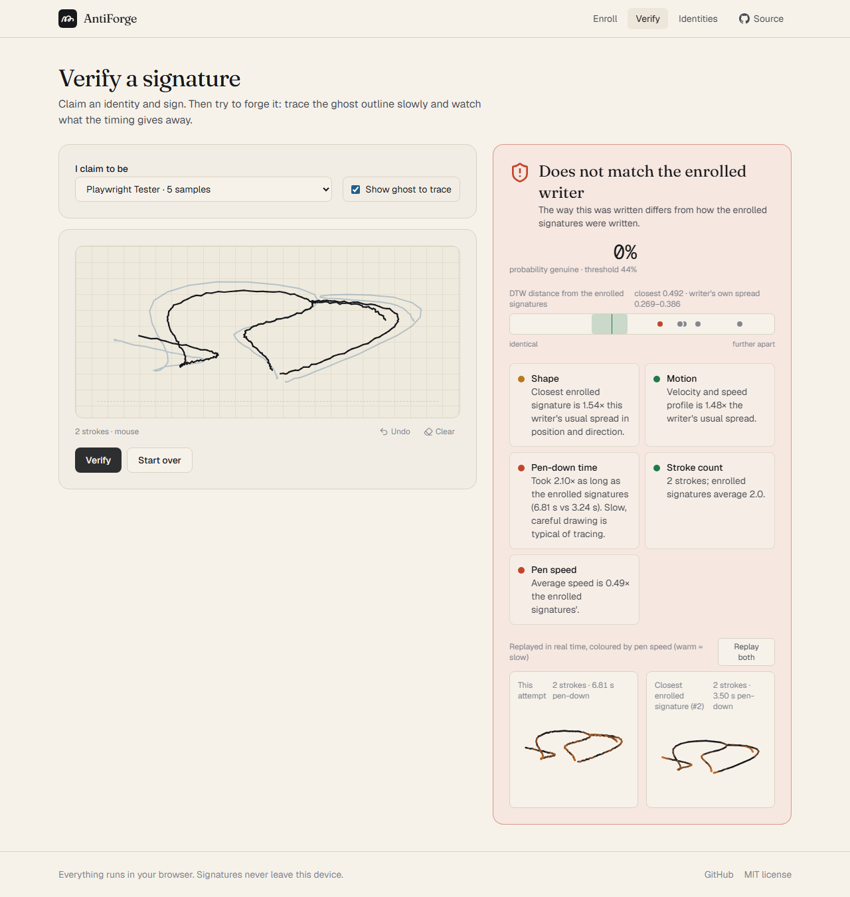
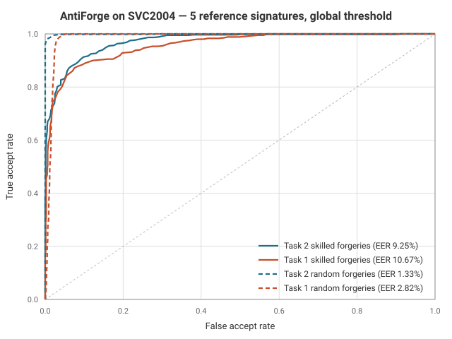

# AntiForge

**Online signature verification. Enroll a handwritten signature, then detect forgeries by how it was written, not just how it looks.**

Live: **[forgerydetection.vercel.app](https://forgerydetection.vercel.app)** · [](https://github.com/davoA07/AntiForge/actions/workflows/ci.yml)

Everything runs in the browser: capture, feature extraction, matching and storage. There is no backend and nothing is uploaded.



---

## Why "online"

Most signature checkers compare two pictures. That is *offline* verification, and it is the easy case for a forger: an outline can be traced. AntiForge does *online* verification. Every pointer sample is recorded with a high-resolution timestamp (and pressure on pens), so the system knows where the pen was, when, and how fast it was moving. A forger who traces a shape produces the right picture at the wrong speed, with the wrong rhythm.

## How verification works

The engine is about 500 lines of dependency-free TypeScript in [`src/lib/engine`](src/lib/engine). The same code runs in the page and in the benchmark.

1. **Capture.** `SignaturePad` records Pointer Events, including coalesced events, with `event.timeStamp`, pressure and pointer type. A stroke is one pen-down to pen-up segment.
2. **Preprocess** ([`preprocess.ts`](src/lib/engine/preprocess.ts)). Each stroke is resampled on a uniform 100 Hz grid, then the whole signature is centred on its centroid and scaled by its RMS radius, so where and how large it was drawn carry no weight. Per-sample velocity, speed and direction are derived by central differences; pressure is normalised per signature. Channels are multiplied by calibrated scales so they are commensurate.
3. **Match** ([`dtw.ts`](src/lib/engine/dtw.ts)). Dynamic Time Warping with a Sakoe-Chiba band around the diagonal of the (non-square) cost matrix, Euclidean local cost, normalised by the sum of the lengths. Three matchers run: all channels, shape only (`x, y, dirX, dirY`) and dynamics only (`vx, vy, speed, pressure`), so the decision can tell "right shape, wrong motion" apart.
4. **Enroll** ([`template.ts`](src/lib/engine/template.ts)). Three or more references (five recommended). The template stores the pairwise DTW distances between references under each matcher. That intra-writer spread is the yardstick for everything checked later; an outlying reference is flagged in the UI so the user can redo it.
5. **Decide** ([`verify.ts`](src/lib/engine/verify.ts)). A query's distances to the references are expressed relative to the writer's own spread (`ln(d_min / μ)`, `ln(d_mean / μ)`, a nearest-neighbour ratio, a z-score, the same for each channel group) plus the pen-down time ratio and stroke-count difference. A logistic model fitted on SVC2004 turns these into a probability; the threshold sits at the equal-error point of the fitting set.

Results come back with the per-reference distances, the writer's spread, and human-readable factors (shape, motion, pen-down time, stroke count, speed), which the UI shows next to a real-time replay of the attempt and its closest enrolled signature, coloured by pen speed.

## Benchmark

Numbers below are produced by `pnpm bench` against the public [SVC2004](https://www.cse.ust.hk/svc2004/) corpus and written to [`bench/results/summary.json`](bench/results/summary.json). The landing page reads the same file.

**Protocol.** For each of the 40 writers per task: enroll from genuine samples 1–5; test on genuine samples 6–20 (15 trials), skilled forgeries 21–40 (20 trials, made by people who studied and practised the signature), and one genuine sample from each other writer (39 random forgeries). Task 1 has x, y and time; Task 2 adds pen pressure. All figures use **one global threshold for every writer**, which is what the app ships. "Per-writer EER" assumes an ideal threshold per writer and is given only because that is how much of the literature reports.

| | Skilled-forgery EER | Random-forgery EER | AUC (skilled) | Per-writer EER |
|---|---|---|---|---|
| Task 1 (x, y, t) | **10.7 %** | 2.8 % | 0.958 | 6.5 % |
| Task 2 (+ pressure) | **9.3 %** | 1.3 % | 0.972 | 3.0 % |

Held-out generalisation (model fitted on one task's writers, scored on the other's): skilled EER 10.3 % (fit Task 1 → Task 2) and 12.5 % (fit Task 2 → Task 1). The shipped model is fitted on both tasks; the decision threshold is 0.44.



For context, published DTW-based systems on the released SVC2004 set report skilled-forgery EERs of roughly 3–7 % with more elaborate normalisation and user-specific classifiers; simple global-threshold systems typically land in the 8–15 % range. SVC2004 was captured on a tablet, so real-world error rates with a mouse or trackpad will be worse.

Reproduce:

```bash
pnpm bench:fetch       # downloads Task1.zip / Task2.zip into bench/data (git-ignored)
pnpm bench             # evaluates the shipped calibration, rewrites bench/results/
pnpm bench:calibrate   # additionally refits feature scales + decision model into src/lib/engine/calibration.json
```

`bench/run.ts` also takes `--band`, `--smooth`, `--drop`, `--weight`, `--norm`, `--features` and `--lambda` for experiments. The constants in `calibration.json` are generated; do not hand-edit them.

## Project layout

```
src/lib/engine/     preprocess → dtw → template → verify; calibration.json (generated)
src/app/            Next.js App Router pages: /, /enroll, /verify, /identities
src/components/     SignaturePad (capture), SignatureReplay, VerdictCard, RocChart
src/lib/store.ts    IndexedDB persistence (idb-keyval) with JSON export/import
bench/              SVC2004 reader, metrics (ROC/EER/AUC), logistic fit, runner
```

Stack: Next.js 16 (static export), React 19, TypeScript, Tailwind CSS 4, Vitest. Runtime dependencies are `react`, `next`, `idb-keyval` and `lucide-react`.

## Getting started

Requires Node.js 20.9+ and pnpm.

```bash
git clone https://github.com/davoA07/AntiForge.git
cd AntiForge
pnpm install
pnpm dev          # http://localhost:3000
pnpm test         # engine + bench unit tests
pnpm build        # static export to out/
```

No environment variables. Deploys to Vercel on push to `main`.

## Limitations

- **Mouse is not pen.** The benchmark validates the algorithm on tablet data; mouse and trackpad input has coarser dynamics and will score worse.
- **Practised forgers get through.** At the equal-error point roughly one in ten skilled SVC2004 forgeries is accepted. This demonstrates the technique; it is not an access control.
- **Five samples is a small estimate.** The writer's variation is measured from ten pairwise distances. Enrollment flags outliers, but the band is still noisy.
- **No liveness or anti-replay.** The raw trajectory is what gets compared. Anyone holding a recording of it can replay it. A server-side deployment would need a challenge and device attestation.
- **Threshold is global.** A per-writer threshold learned from more samples over time would lower error rates; the app does not do this yet.

## Author

**David Aydenjian** — Computer Science student focused on machine learning.
GitHub [@davoA07](https://github.com/davoA07) · [LinkedIn](https://www.linkedin.com/in/david-aydenjian-a89402328/)

Originally prototyped at JCH 4.0; rebuilt from scratch in September 2026.

## License

MIT — see [`LICENSE`](LICENSE). SVC2004 is distributed by HKUST for research use and is not included in this repository.
